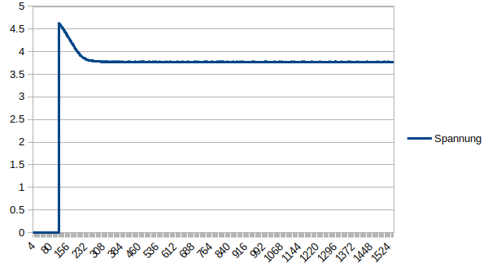

# COMPILE

´g++ cppfile.cpp -lb15fdrv -o outfile´

# analogRead.cpp

Gibt die Spannung zwischen AE0 und GND in die Console aus.

Mit ´$ ./analogRead > messung.txt´ werden die messungen in eine Textdatei gescpeichert.
Nach Löschung des headers kann die Textdatei in LibreOffice Calc in einen Graphen umgewandelt werden.

Erkennbar ist der Spannungsabfall nach Anlegen der Versorgunsspannung. 

# knight-rida.cpp

Misst dip schalter als 8 bit int. Wenn die gerade ist, wird die zahl invertiert vom board ausgegeben. Wenn ungerade, dann wird der knightrida mode eingeschaltet und das board spricht mit uns.

